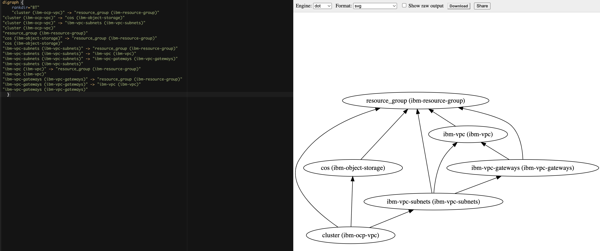

# Use IasCable to create a VPC and a Red Hat OpenShift cluster on IBM Cloud

The following list represents the modules which are referenced in the example [IBM ROKS Bill of Materials](https://github.com/cloud-native-toolkit/iascable#ibm-roks-bill-of-materials) for [IasCable](https://github.com/cloud-native-toolkit/iascable).

* [IBM VPC `ibm-vpc`](https://github.com/cloud-native-toolkit/terraform-ibm-vpc)
* [IBM VPC Subnets `ibm-vpc-subnets`](https://github.com/cloud-native-toolkit/terraform-ibm-vpc-subnets)
* [IBM Cloud VPC Public Gateway `ibm-vpc-gateways`](https://github.com/cloud-native-toolkit/terraform-ibm-vpc-gateways)
* [IBM OpenShift VPC cluster `ibm-ocp-vpc`](https://github.com/cloud-native-toolkit/terraform-ibm-ocp-vpc)

## Pre-requisites for the example

Following tools need to be installed on your local computer to follow the step by step instructions.

* Terraform
* Git

That is the cloud environment we will use.

* IBM Cloud

## Step by step example setup

### Step 1: Write the `Bill of Material` BOM file

```sh
nano my-vpc-roks-bom.yaml
```

Copy and past the following content intoo the `my-vpc-roks-bom.yaml` file.

```yaml
apiVersion: cloudnativetoolkit.dev/v1alpha1
kind: BillOfMaterial
metadata:
  name: my-ibm-vpc-roks
spec:
  modules:
    - name: ibm-vpc
    - name: ibm-vpc-subnets
    - name: ibm-vpc-gateways
    - name: ibm-ocp-vpc
      variables:
        - name: worker_count
          value: 1
```

### Step 2: Build the project based on `Bill of Material` BOM file

```sh
iascable build -i my-vpc-roks-bom.yaml
```

* Output:

```sh
Loading catalog from url: https://modules.cloudnativetoolkit.dev/index.yaml
Name: my-ibm-vpc-roks
Writing output to: ./output
```

### Step 3: Verify the create files and folders

```sh
tree
```

* Output:

```sh
.
├── my-vpc-roks-bom.yaml
└── output
    ├── launch.sh
    └── my-ibm-vpc-roks
        ├── apply.sh
        ├── bom.yaml
        ├── dependencies.dot
        ├── destroy.sh
        └── terraform
            ├── docs
            │   ├── ibm-object-storage.md
            │   ├── ibm-ocp-vpc.md
            │   ├── ibm-resource-group.md
            │   ├── ibm-vpc-gateways.md
            │   ├── ibm-vpc-subnets.md
            │   └── ibm-vpc.md
            ├── main.tf
            ├── my-ibm-vpc-roks.auto.tfvars
            ├── providers.tf
            ├── variables.tf
            └── version.tf

4 directories, 17 files
```

You can find details of the create files and folders also in [IasCable starting point GitHub project](https://github.com/thomassuedbroecker/iascable-starting-point) and that [blog post](https://suedbroecker.net/2022/07/06/get-started-with-an-installable-component-infrastructure-by-selecting-components-from-a-catalog-of-available-modules-with-iascable/).

In the newly created `bom.yaml` file we find more detailed information about modules we are going to use.

```yaml
apiVersion: cloudnativetoolkit.dev/v1alpha1
kind: BillOfMaterial
metadata:
  name: my-ibm-vpc-roks
spec:
  modules:
    - name: ibm-ocp-vpc
      alias: cluster
      version: v1.15.4
      variables:
        - name: worker_count
          value: 1
    - name: ibm-vpc
      alias: ibm-vpc
      version: v1.16.0
    - name: ibm-vpc-gateways
      alias: ibm-vpc-gateways
      version: v1.9.0
    - name: ibm-vpc-subnets
      alias: ibm-vpc-subnets
      version: v1.13.2
    - name: ibm-resource-group
      alias: resource_group
      version: v3.2.16
    - name: ibm-object-storage
      alias: cos
      version: v4.0.3
  variables:
    - name: region
      type: string
      description: The IBM Cloud region where the cluster will be/has been installed.
    - name: ibmcloud_api_key
      type: string
      description: The IBM Cloud api token
    - name: worker_count
      type: number
      description: >-
        The number of worker nodes that should be provisioned for classic
        infrastructure
      defaultValue: 1
    - name: cluster_flavor
      type: string
      description: The machine type that will be provisioned for classic infrastructure
      defaultValue: bx2.4x16
    - name: ibm-vpc-subnets__count
      type: number
      description: The number of subnets that should be provisioned
      defaultValue: 3
    - name: resource_group_name
      type: string
      description: The name of the resource group
```

* [(Network) IBM VPC `ibm-vpc`](https://github.com/cloud-native-toolkit/terraform-ibm-vpc)
* [(Network) IBM VPC Subnets `ibm-vpc-subnets`](https://github.com/cloud-native-toolkit/terraform-ibm-vpc-subnets)
* [(Network) IBM Cloud VPC Public Gateway `ibm-vpc-gateways`](https://github.com/cloud-native-toolkit/terraform-ibm-vpc-gateways)
  
  This module makes use of the output from other modules:
  * Resource group - github.com/cloud-native-toolkit/terraform-ibm-resource-group.git
  * VPC - github.com/cloud-native-toolkit/terraform-ibm-vpc.git

* [(Cluster) IBM OpenShift VPC cluster `ibm-ocp-vpc`](https://github.com/cloud-native-toolkit/terraform-ibm-ocp-vpc)

  This module makes use of the output from other modules:
  * Object Storage - github.com/cloud-native-toolkit/terraform-ibm-object-storage.git
  * VPC - github.com/cloud-native-toolkit/terraform-ibm-vpc.git
  * Subnet - github.com/cloud-native-toolkit/terraform-ibm-vpc.git

Added modules based on module dependencies:

* [(IAM) IBM Resource Group `ibm-resource-group`](https://github.com/cloud-native-toolkit/terraform-ibm-resource-group)
* [(Storage) IBM Object Storage `ibm-object-storage`](https://github.com/cloud-native-toolkit/terraform-ibm-object-storage)

We can verify the dependencies with the `dependencies.dot` content for example in [Graphviz Online](https://dreampuf.github.io/GraphvizOnline/).




